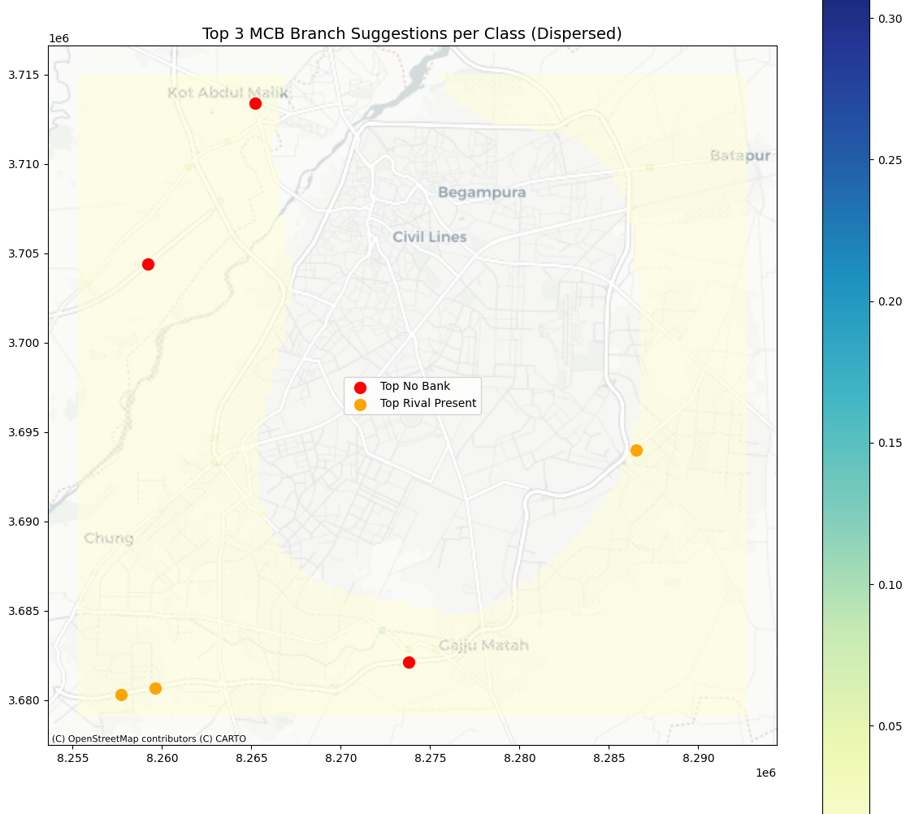

# MCB Branch Placement Analysis in Lahore

## Project Overview

This project conducts a comprehensive geospatial analysis to identify optimal locations for new MCB Bank branches and ATMs in Lahore, Pakistan. By leveraging data from OpenStreetMap, the analysis pinpoints underserved areas and strategic locations that could enhance MCB's market presence.

The primary goal is to provide data-driven recommendations for branch placement by evaluating factors such as competitor density, population distribution, and accessibility.

## Key Features

-   **Data Extraction**: Utilizes `pyrosm` to parse bank and ATM data from OpenStreetMap's `lahore.osm.pbf` file.
-   **Competitor Analysis**: Classifies financial points of interest (POIs) as either "MCB" or "Rival" to map out the competitive landscape.
-   **Interactive Visualization**: Employs `folium` to generate interactive maps that display:
    -   Clustered markers for MCB and rival bank locations.
    -   A density heatmap of rival banks to highlight competitive hotspots.
-   **Spatial Analysis**:
    -   Performs Kernel Density Estimation (KDE) to model the spatial distribution of both MCB and rival institutions.
    -   Calculates a "suitability score" for potential new branch locations based on a multi-criteria analysis.
-   **Strategic Recommendations**: Identifies and ranks the top 3 locations for new MCB branches in two key scenarios:
    1.  **Untapped Opportunities**: Areas with no existing bank presence.
    2.  **Competitive Opportunities**: Areas with rival banks but no MCB branch.

## Visualizations

### 🗺️ MCB vs. Rival Bank Locations


*A strategic overview of Lahore's financial landscape, this map visualizes the distribution of MCB branches (in green) against competitor locations (in red). The clustering reveals key market dynamics and areas of direct competition.*

***

### 🔥 Rival Bank Density Heatmap


*This heatmap cuts through the noise, illustrating the concentration of rival banking institutions. The "hotter" red areas signify high-density zones, providing a clear visual guide to the most competitive hotspots in the city.*

***

### 📍 Recommended MCB Branch Locations



*Data-driven recommendations at a glance. This map pinpoints the top three suggested locations for new MCB branches, strategically categorized by opportunity type: untapped markets and areas where competitors are present but MCB is not.*

Text File (`top_mcb_locations.txt`) includes the final ranked coordinates and suitability scores for the above top recommended MCB branch locations.

## Technical Details

-   **Data Source**: OpenStreetMap (`Dataset\lahore.osm.pbf`)
-   **Key Libraries**:
    -   `pyrosm`: For parsing OpenStreetMap data.
    -   `pandas` & `geopandas`: For data manipulation and spatial analysis.
    -   `folium`: For creating interactive maps.
    -   `scipy` & `jenkspy`: For Kernel Density Estimation and classification.
    -   `matplotlib`: For plotting static maps and charts.

## How to Run This Project

1.  **Clone the repository:**
    ```bash
    git clone https://github.com/sleeping3119/MCB-Branch-Placement-Analysis-Lahore.git
    cd MCB-Branch-Placement-Analysis-Lahore
    ```
2.  **Set up the environment:**
    It is recommended to use a virtual environment.
    ```bash
    python -m venv venv
    source venv/bin/activate  # On Windows, use `venv\Scripts\activate`
    ```
3.  **Install Dependencies:**
    This project uses modern Python packaging. You can use `pip` with the `pyproject.toml` file or a faster package manager like `uv` with `uv.lock` file.

    **Using `pip` (standard):**
    ```bash
    # May fail better use conda or uv
    pip install .
    ```
    OR

    **Using `uv` (Faster and better, do this if you have uv installed):**
    ```bash
    # Sync dependencies from the lock file
    uv pip sync uv.lock
    ```
5.  **Launch Jupyter Notebook:**
    ```bash
    jupyter notebook main.ipynb
    ```

## Future Work

-   Incorporate demographic data (e.g., income levels, population age) for a more nuanced suitability analysis.
-   Analyze foot traffic and commercial activity data to further refine location scores.
-   Develop a dynamic web application to explore the results interactively.

---
